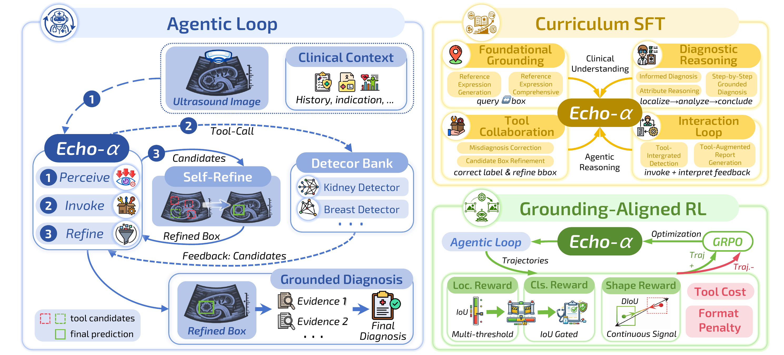
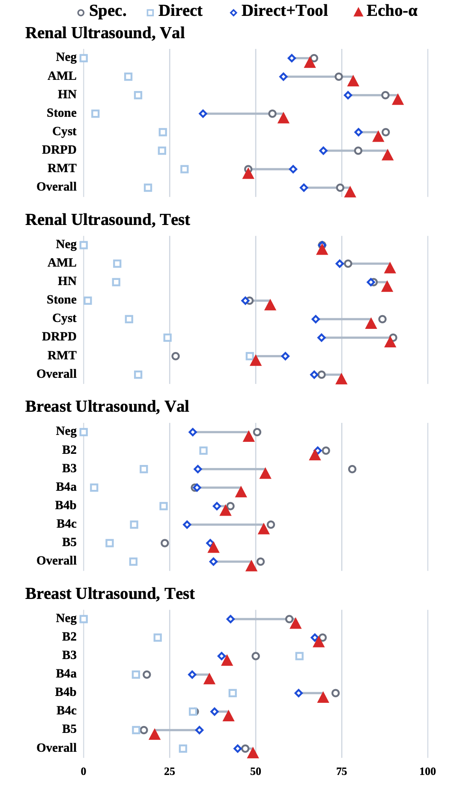
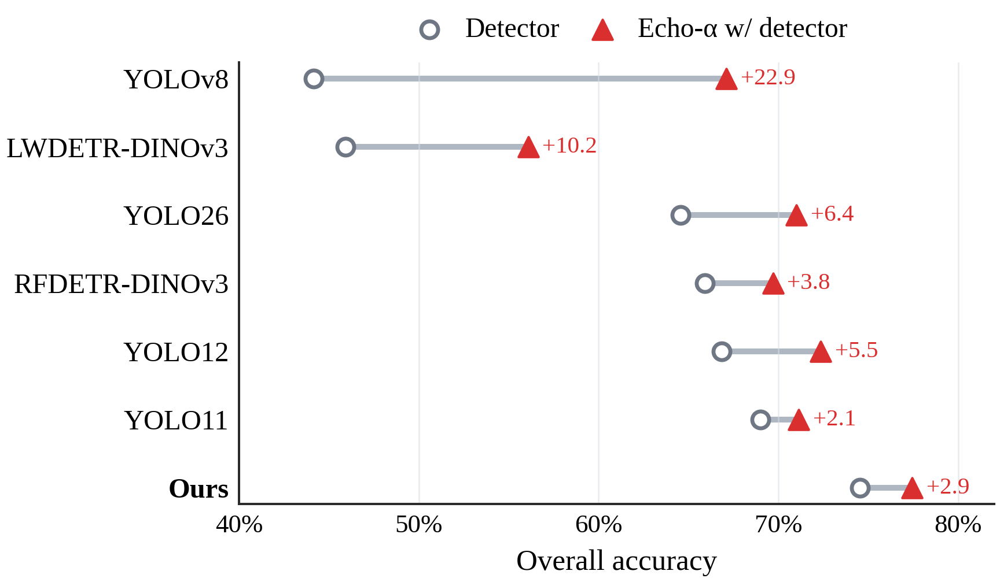
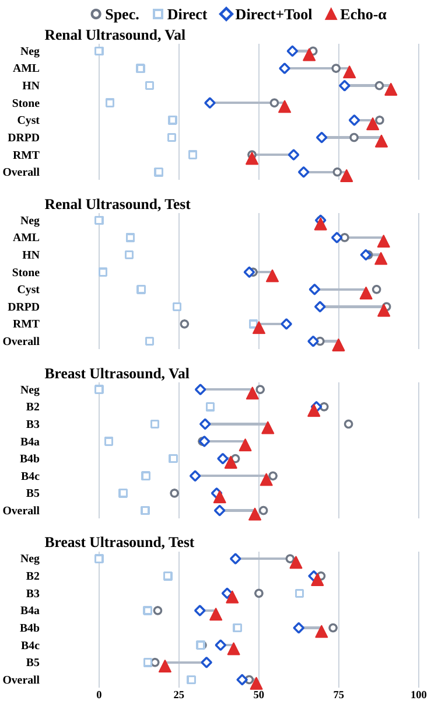
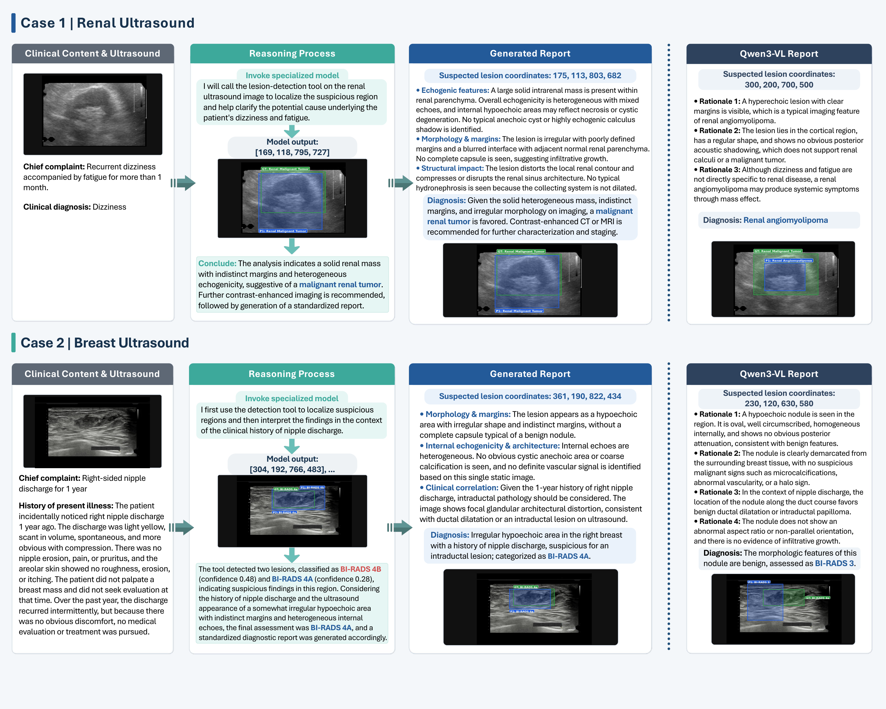

<div align="center">

<h2 align="center"><strong>Echo-&alpha;: Agentic Multimodal Reasoning for Ultrasound Interpretation</strong></h2>

<div align="center">
<h5>
<em>Jing Zhang<sup>1,*</sup>, Wentao Jiang<sup>1,*</sup>, Tao Huang<sup>1</sup>, Zhiwei Wang<sup>1</sup>, Jianxin Liu<sup>2</sup>, Jian Chen<sup>2</sup>, Ping Ye<sup>2</sup>, Gang Wang<sup>3</sup>, Zengmao Wang<sup>1</sup>, Bo Du<sup>1</sup>, Dacheng Tao<sup>4</sup></em>
<br><br>
<sup>1</sup> School of Computer Science, Wuhan University, China<br/>
<sup>2</sup> The Central Hospital of Wuhan, China<br/>
<sup>3</sup> Taizhou Hospital of Zhejiang Province, China<br/>
<sup>4</sup> Nanyang Technological University, Singapore
</h5>
<h5><sup>*</sup> Equal contribution</h5>
</div>

<h5 align="center">
<a href="https://arxiv.org/pdf/2604.05210"></a>
<a href=""></a>
<a href=""></a>
</h5>

**An invoke-and-reason ultrasound agent that coordinates organ-specific detector tools, verifies grounded visual evidence, and converts lesion-level observations into clinically meaningful diagnostic decisions.**

[Overview](#overview) | [Highlights](#highlights) | [Framework](#framework) | [Training Recipe](#training-recipe) | [Main Results](#main-results) | [Case Study](#case-study) | [Citation](#citation)

</div>

---

## Overview

Ultrasound interpretation requires both precise lesion localization and holistic clinical reasoning. Specialized detectors are strong at localization but provide limited diagnostic reasoning, while general multimodal large language models (MLLMs) can reason in language but remain weak at fine-grained spatial grounding in specialized medical images.

**Echo-&alpha;** bridges this gap with an **agentic multimodal reasoning** framework. Given a raw ultrasound image and optional clinical context, Echo-&alpha; forms an initial hypothesis, invokes an organ-specific lesion detector through a structured tool interface, reads the returned boxes and labels, and synthesizes a final grounded diagnosis. The model is trained to treat detector outputs as revisable clinical evidence rather than as final predictions.

<div align="center">
  
  <p><em>Echo-&alpha; unifies visual perception, detector evidence, and multimodal clinical reasoning in an invoke-and-reason loop.</em></p>
</div>

---

## Highlights

* **Agentic ultrasound interpretation:** Echo-&alpha; places an MLLM at the center of an invoke-and-reason loop for grounded diagnosis.
* **Tool-grounded visual evidence:** Organ-specific detectors return rendered visualizations and structured metadata, including coordinates, confidence scores, and lesion labels.
* **Nine-task supervised curriculum:** The SFT stage covers REC, REG, direct diagnosis, attribute reasoning, grounded analysis, detector correction, tool interpretation, and interaction-loop behavior.
* **Sequential RL specialization:** The same SFT initialization is optimized into **Echo-Ground** for lesion anchoring and **Echo-Diag** for final diagnosis.
* **Multi-center evaluation:** Renal and breast ultrasound benchmarks are evaluated with in-center validation and cross-center testing.
* **Detector-agnostic behavior:** The agent improves diagnosis across multiple detector backbones, suggesting that learned tool use is not tied to a single detector.


## Framework

Echo-&alpha; is designed around a **detect, verify, and reason** workflow.

1. **Initial multimodal reasoning:** The model inspects the ultrasound image and optional clinical context to form a preliminary interpretation.
2. **Structured detector invocation:** The agent calls an organ-specific detector tool through a function-like interface.
3. **Evidence ingestion:** The tool returns a rendered detection image plus structured metadata containing candidate boxes, labels, and confidence scores.
4. **Grounded synthesis:** Echo-&alpha; compares tool evidence against global ultrasound appearance and produces a grounded diagnostic decision.

For renal ultrasound, the detector covers six lesion categories: angiomyolipoma, hydronephrosis, renal stone, renal cyst, diffuse renal parenchymal disease, and renal malignant tumor. For breast ultrasound, the detector predicts BI-RADS categories, including BI-RADS 2, 3, 4A, 4B, 4C, and 5.

The core agent is independent of a particular detector implementation. New anatomical domains can be introduced by exposing another detector through the same structured interface.

---

## Training Recipe

### Stage 1: Supervised Fine-Tuning

The SFT stage teaches Echo-&alpha; complementary grounding, reasoning, and tool-use skills through a nine-task curriculum:

| Tier | Tasks | Purpose |
| :--- | :--- | :--- |
| **Foundational grounding** | Referring Expression Comprehension and Referring Expression Generation | Learn lesion-box alignment and lesion description |
| **Diagnostic reasoning** | Direct diagnosis, attribute explanation, multi-step grounded analysis | Connect sonographic observations with disease categories |
| **Tool collaboration** | Box refinement, category correction, localization-classification assessment | Learn to revise detector outputs instead of copying them |
| **Interaction loop** | Tool invocation and feedback interpretation | Learn when and how to use detector evidence |

Training rationales are generated with teacher-forcing context that includes ground-truth annotations and specialized-detector predictions. The result is a shared SFT initialization for both grounding and diagnosis variants.

### Stage 2: Reinforcement Learning

Echo-&alpha; is further optimized with Group Relative Policy Optimization (GRPO). The reward combines:

| Reward | Role |
| :--- | :--- |
| **Localization reward** | Encourages overlap between predicted and ground-truth boxes |
| **Classification reward** | Rewards correct class prediction when localization is sufficiently accurate |
| **Shape reward** | Uses DIoU-style alignment to improve compact box quality |
| **Tool cost** | Penalizes redundant detector calls while preserving strategic tool use |

Different reward weights produce two specialized variants. **Echo-Ground** emphasizes lesion anchoring and box refinement. **Echo-Diag** shifts the objective toward diagnosis while retaining localization constraints.

---

## Main Results

Echo-&alpha; is evaluated on renal and breast ultrasound benchmarks under a multi-center protocol. The validation split measures same-center generalization, while the test split measures cross-center robustness.

### Grounding

| Split | Specialized Detector F1@0.5 | Direct MLLM + Tool F1@0.5 | Echo-Ground F1@0.5 |
| :--- | ---: | ---: | ---: |
| Renal Val | 69.70 | 56.56 | **70.78** |
| Renal Test | 52.63 | 50.11 | **56.73** |
| Breast Val | 46.68 | 36.61 | **50.37** |
| Breast Test | 42.01 | 37.25 | **43.78** |

### Diagnosis

| Split | Specialized Detector Acc. | Direct MLLM + Tool Acc. | Echo-Diag Acc. |
| :--- | ---: | ---: | ---: |
| Renal Val | 74.53 | 63.99 | **77.43** |
| Renal Test | 69.13 | 66.99 | **74.90** |
| Breast Val | **51.41** | 37.71 | 48.75 |
| Breast Test | 46.96 | 44.75 | **49.20** |

<div align="center">
  
  <p><em>Compact visualization of the main grounding and diagnosis results reported in the paper.</em></p>
</div>

### Detector-Agnostic Tool Generalization

Replacing the renal detector with YOLO-family, LW-DETR-DINOv3, and RF-DETR-DINOv3 backbones shows that Echo-&alpha; consistently improves detector-only diagnosis. The gains are largest for weaker or sparser detectors and remain positive for stronger detectors.

| Detector | Detector Acc. | Echo-&alpha; Acc. | Gain |
| :--- | ---: | ---: | ---: |
| YOLOv8 | 44.16 | 67.11 | +22.95 |
| LWDETR-DINOv3 | 45.91 | 56.08 | +10.17 |
| YOLO26 | 64.56 | 71.01 | +6.45 |
| RFDETR-DINOv3 | 65.91 | 69.70 | +3.79 |
| YOLO12 | 66.85 | 72.35 | +5.50 |
| YOLO11 | 68.99 | 71.14 | +2.15 |
| Ours | **74.53** | **77.43** | +2.90 |

<div align="center">
  
  <p><em>Detector-only diagnosis versus Echo-&alpha; with the same detector evidence.</em></p>
</div>

<div align="center">
  
  <p><em>Class-wise diagnosis trends across renal and breast ultrasound evaluation splits.</em></p>
</div>

---

## Case Study

Echo-&alpha; uses detector feedback as evidence to be checked against the image, not as a prediction to blindly copy.

In a renal example, the raw MLLM favors a benign angiomyolipoma from a smaller benign-looking region, while Echo-&alpha; grounds a larger lesion and predicts malignant renal tumor based on heterogeneous echoes, indistinct margins, and local structural distortion. In a breast example, the raw MLLM reports a benign BI-RADS 3 assessment, while Echo-&alpha; predicts BI-RADS 4A after comparing two tool-returned ductal-region candidates with clinical context such as persistent nipple discharge.

<div align="center">
  
  <p><em>Representative renal and breast ultrasound cases showing how grounded tool evidence changes final interpretation.</em></p>
</div>

---

## Citation

If you find **Echo-&alpha;** useful for your research, please cite:

```bibtex
@article{echo-alpha,
  title        = {Echo-alpha: Agentic Multimodal Reasoning for Ultrasound Interpretation},
  author       = {Zhang, Jing and Jiang, Wentao and Huang, Tao and Wang, Zhiwei and Liu, Jianxin and Chen, Jian and Ye, Ping and Wang, Gang and Wang, Zengmao and Du, Bo and Tao, Dacheng},
  year         = {2026},
  journal={arXiv preprint arXiv:2604.05210},
}
```

